# Руководство пользователя приложения "Генератор частоты"

## Введение
Данное руководство предназначено для упрощения понимания работы приложения для пользователей. Приложение доступно только для пользователей **Android**! Бесплатная версия приложения имеет достаточный функционал для генерации звуковых частот (одночастотный и многочастотный генератор, синтезатор, генератор шума, и т.д.). Также вы можете приобрести Pro-версию приложения с расширенными функциями:
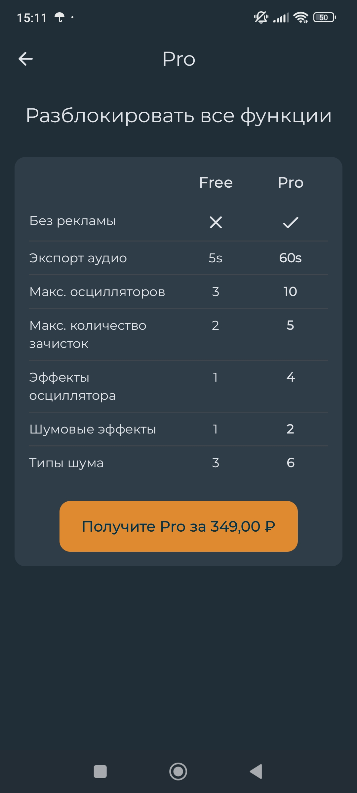
_Рисунок 1: Отличие бесплатной версии от Pro_

## Настройки приложения
Для перехода в меню настроек, нажмите на иконку из трёх точек в правом верхнем углу экрана. Выберите **Настройки**:
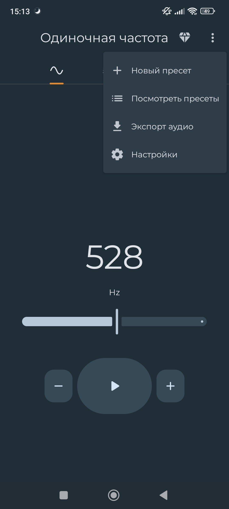
_Рисунок 2: Главное меню с открытой вкладкой_
### Общие настройки
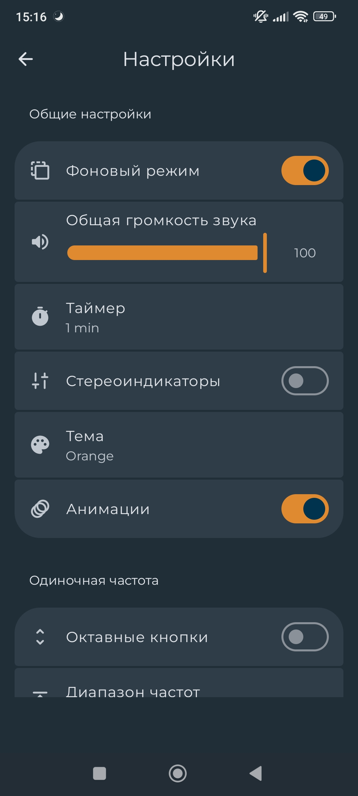
_Рисунок 3: Меню настроек_

- **Фоновый режим** - позволяет приложению работать в фоновом режиме, продолжая генерировать частоты или шум.

- **Общая громкость звука** - изменяет громкость звука самого приложения.

- **Таймер** - установка времени работы генерации звука.

- **Стереоиндикаторы** - визуальное отображение работы левого, правого, или обоих одновременно каналов.

- **Тема** - выбор цветовой темы приложения. Доступно 2 темы: **Orange** и **Legacy Blue**.

- **Анимации** - отображение анимаций волн.

### Одночастотный и многочастотный генератор
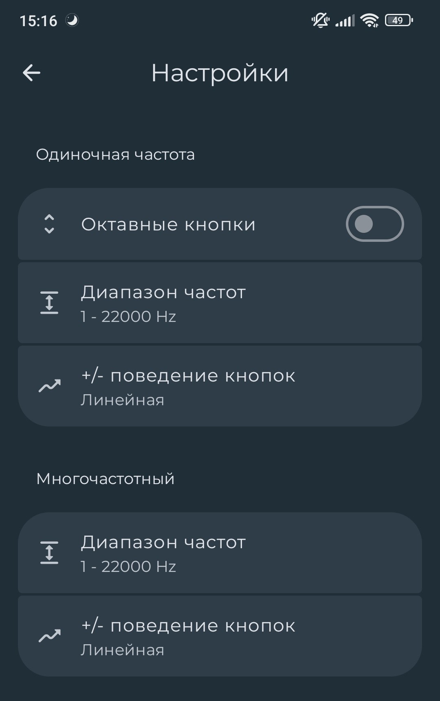
_Рисунок 4: Настройки меню "Одиночная частота" и "Многочастотный"_

- **Октавные кнопки** - добавляет кнопки, увеличивающие и уменьшающие частоту в 2 раза.

- **Диапазон частот** - настройка диапазона частот.

- **+/- поведение кнопок** - изменяет скорость изменения частот при удерживании кнопок (линейная или экспоненциальная).

### Расширенные функции и дополнения
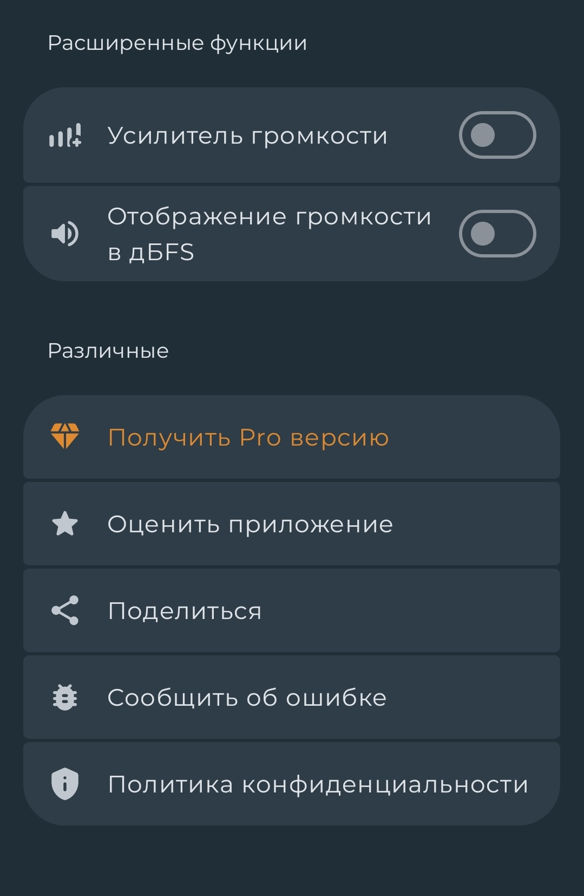
_Рисунок 5: Расширенные функции и дополнения для пользователя_

- **Усилитель громкости** - усиливает громкость генерируемого звука.
- **Отображение громкости в дБ FS** - отображает громкость регулируемого звука в децибелах.
> [!NOTE]
> На данном меню пользователю доступны возможности получить Pro-версию приложения, оценить приложение, поделиться в социальных сетях, сообщить об ошибке, и ознакомиться с политикой конфиденциальности.

### Пресеты и экспорт аудио
Из открытой вкладки в правом верхнем углу (см. рисунок 2) вам также доступно создание, просмотр, переименование, и удаление пресетов для генерации определённых комбинаций частот.
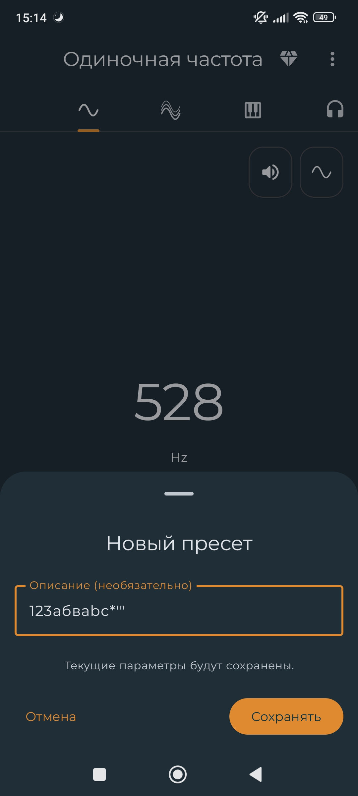
_Рисунок 6: Создание пресета_
 
> [!NOTE]
> Для создания пресета вы можете использовать любые удобные символы.

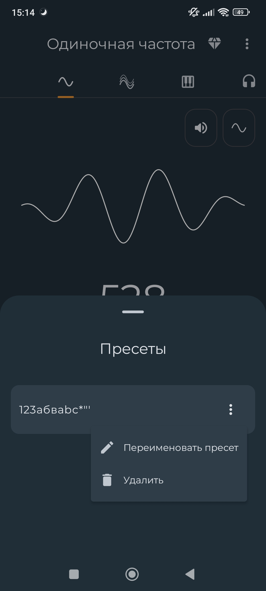
_Рисунок 7: Редактирование списка пресетов_

Из открытой вкладки в правом верхнем меню вы можете перейти в меню экспорта создаваемого аудио.
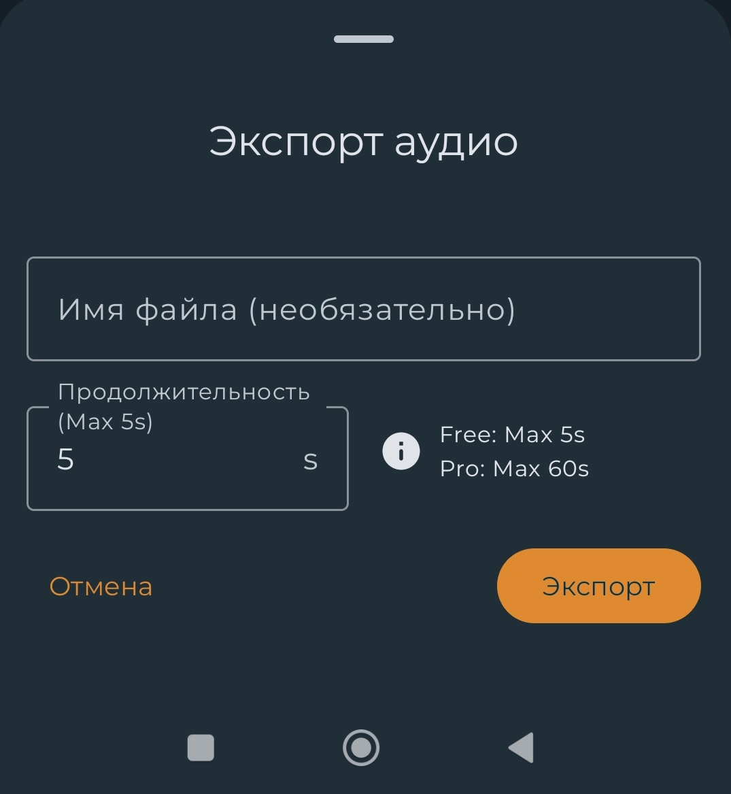
_Рисунок 8: Экспорт аудио_

> [!NOTE]
> Для бесплатной версии вам доступен экспорт звука длительностью лишь до 5 секунд. С Pro-версией эта длительность увеличивается до 1 минуты.

## Одиночная частота
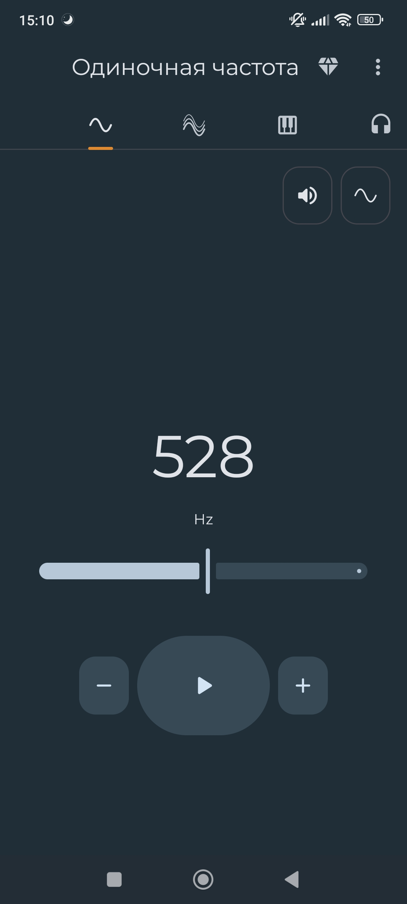
_Рисунок 9: Меню генерации одиночной частоты_

С помощью данного меню, вы можете воспроизводить одиночную частоту, изменяя её в пределах заданного диапазона. Частота изменяется перемещением ползунка, или с помощью кнопок **-** и **+**. Настройки для одиночной частоты доступны в меню **Настройки** (см. рисунок 2). 

При нажатии на кнопку 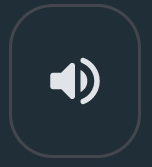 вы переходите в меню настройки громкости: 
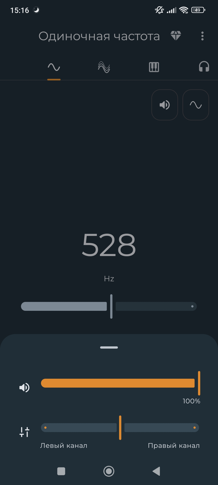
_Рисунок 10: Настройка громкости воспроизводимой частоты_

Здесь вы можете как изменить громкость самого звука в приложении, так и изменить баланс его воспроизведения по левому и правому каналу.

При нажатии на кнопку 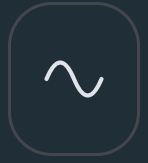 вы переходите в меню изменения формы звуковой волны:
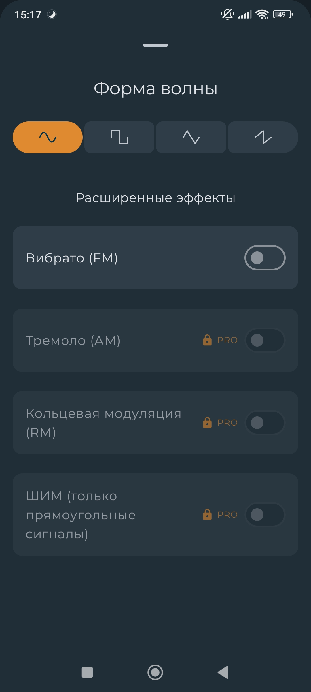
_Рисунок 11: Настройка формы звуковой волны_

Для вас доступны 4 формы звуковой волны. Для бесплатной версии доступен звуковой эффект **Вибрато(FM)**.
> [!NOTE]
> Эффекты Тремоло(AM), кольцевой модуляции(RM), и широтно-импульсная модуляция(только прямоугольные сигналы) доступны только для Pro-версии!

## Многочастотный генератор
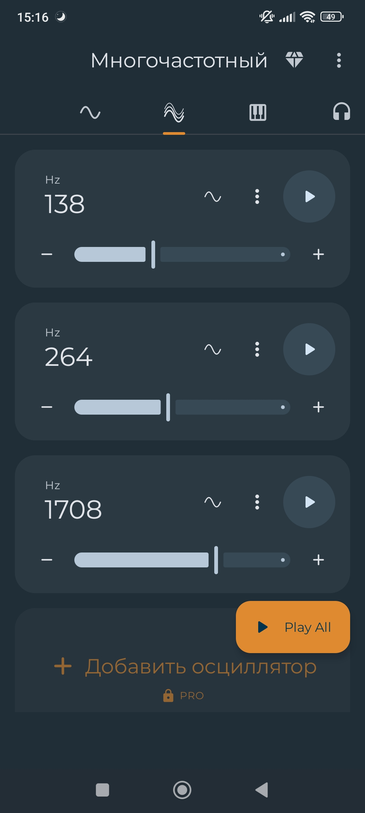
_Рисунок 12: Меню многочастотного генератора_

В данном разделе вы можете создавать и редактировать свой список пресетов, состоящий из нескольких, возможных для воспроизведения частот. Интерфейс аналогичен тому, что имеется в разделе **"Одиночная частота"**.
> [!NOTE]
> В бесплатной версии приложения вы можете использовать только до 3-х частот одновременно.

## Синтезатор
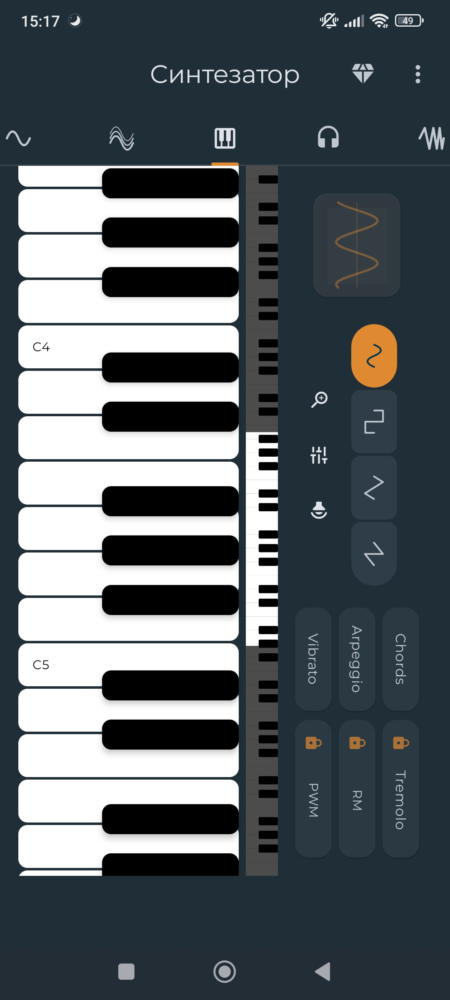
_Рисунок 13: Меню синтезатора_

В этом разделе используется синтезатор с нотами для воспроизведения различных частот. Интерфейс позволяет играть одновременно с несколькими нотами, создавая аккорды. Здесь используются 4 режима использования аккордов.
- **Chords** - базовый режим (при нажатии на ноты аккорды строятся вручную).
- **MAJ** - автоматическое построение мажорных аккордов.
- **MIN** - автоматическое построение минорных аккордов.
- **5ths** - автоматическое построение «пустых» аккордов (ни мажор, ни минор). К выбранной ноте добавляются две дополнительные ноты, создавая мощное звучание.
> [!NOTE]
> Также для вас в бесплатной версии приложения доступны эффекты **Arpeggio** и **Vibrato**.

Вы можете изменять формы звуковых волн и громкость звука, аналогично предыдущим разделам ("Одиночная частота" и "Многочастотный"). Для изменения формы звуковой волны нажмите на кнопку 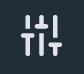, чтобы перейти в меню (см. Рисунок 11). С помощью кнопки  вы можете изменить громкость звука. Для вашего удобства, с помощью кнопки  вы можете изменить масштабирование расположения нот на экране. 

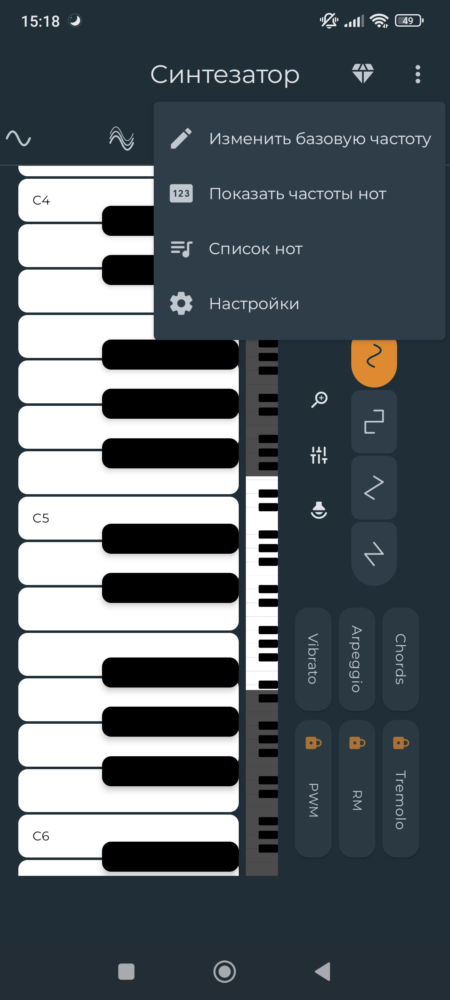
_Рисунок 14: Подменю синтезатора_

Открыв данное подменю вы можете:
- изменить **базовую частоту**
- включить **отображение частот нот**
- перейти в меню **Список нот**
- перейти в **Настройки** приложения

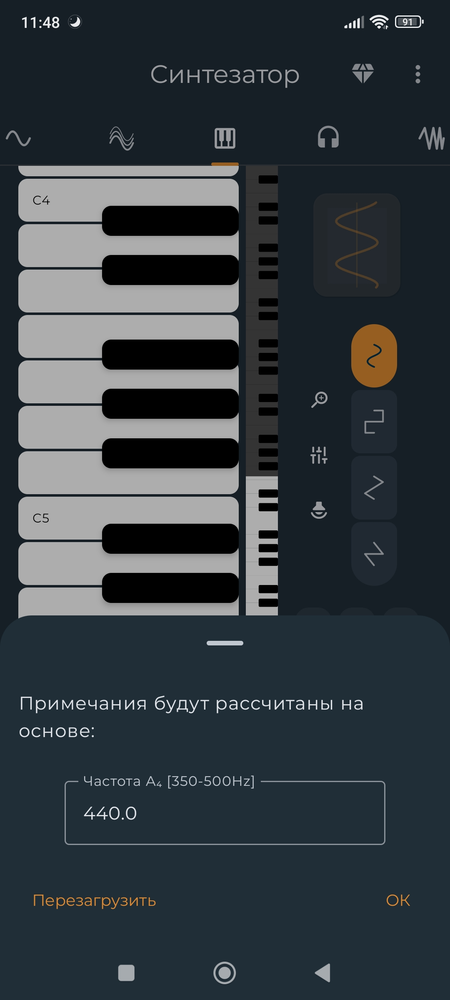
_Рисунок 15: Изменение базовой частоты ноты А4_

При выборе опции **Изменить базовую частоту** в подменю синтезатора (рис. 14) вам откроется данное меню. Базовая частота ноты A4 у синтезатора, как правило, составляет 440 Гц. Это закреплено международным стандартом ISO 16 и считается общепринятым эталоном для настройки музыкальных инструментов. Но по своему желанию в данном меню вы можете ввести своё значение от 350 до 500 Герц. При нажатии кнопки **Перезагрузить** базовая частота вернётся к своему стандартному значению (440 Герц).

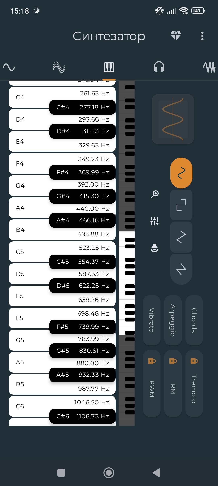
_Рисунок 16: Отображение частот нот в разделе "Синтезатор"_

При выборе опции **Показать частоты нот** на нотах синтезатора будут отображены частоты соответствующих нот.
> [!NOTE]
> При изменении базовой частоты синтезатора, все показанные в приложении частоты также будут изменяться функционально и визуально в меню.

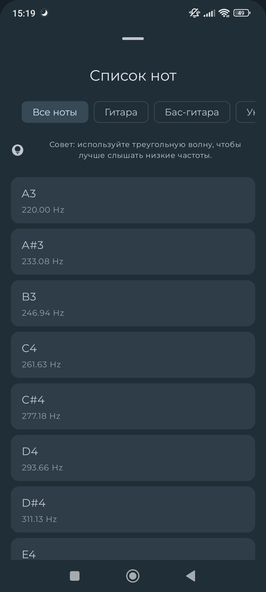
_Рисунок 17: Список нот_

При выборе опции **Список нот**, вы перейдёте в список всех доступных нот, которые вы можете воспроизвести по одной отдельно из списка. В данном меню присутствует разделение нот:
- **Все ноты**
- **Гитара**
- **Бас-гитара**
- **Укулеле**
- **Скрипка**

## Бинауральные ритмы
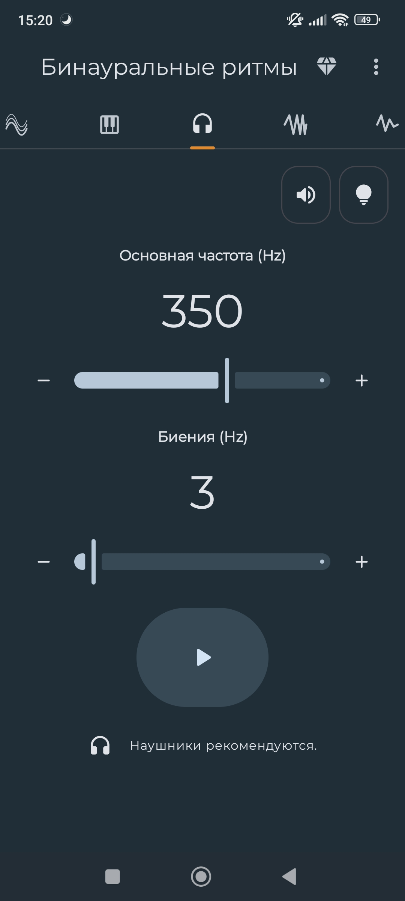
_Рисунок 18: Раздел "Бинауральные ритмы"_

В данном разделе, для прослушивания бинауральных ритмов, доступны изменение основной частоты от 21 до 1200 Герц и биения от 0 до 40 Герц. 

